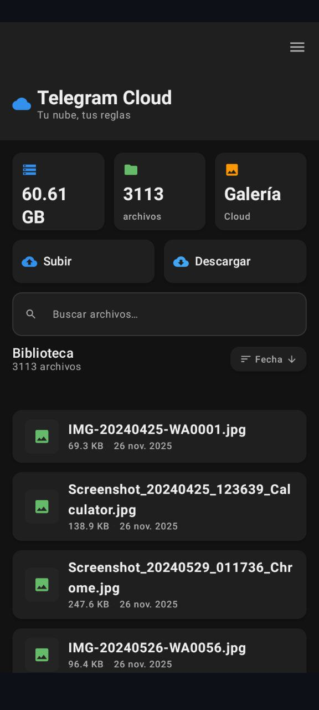

<div style="display: flex; gap: 10px;">

  

 
</div>

# Telegram Cloud Android

Android application to manage files in the cloud using Telegram as a backend. **Your cloud, your rules 🚀.**


## ⚠️ IMPORTANT:

- Minimum Android version: 8.0 (API 28)
- Target Android version: 14 (API 34)
- Requires a Telegram bot token and private channel for operation

## 🚀 Main Features

### No Size or Storage Limits

This application has NO file size or storage limits.**

- **Large files**: Uses chunked upload (4MB) for files of any size.
- **Unlimited storage**: Telegram imposes no practical storage limits.
- **Multiple bots**: Support for multiple bot tokens for higher speed.
- **Parallel upload**: Chunks are uploaded simultaneously.

### Functionalities

- 📤 **Native upload and download**.
- 🖼️ **Media gallery** with automatic synchronization.
- 🔐 **Encrypted backups** and secure database (SQLCipher).
- 🔗 **.link files** for sharing protected content.
- 📱 **Material Design 3 Interface** (Jetpack Compose).
- 🎬 **Integrated video player** (ExoPlayer).

## 📋 Requirements

- **Android 9.0 (API 28)** or higher.
- **Telegram Bot** (Token obtained from @BotFather).
- **Internet Connection**.

### To Build from Source Code

- **Android SDK** with API 28+.
- **Android NDK** (Recommended version: **r25c**).
- **CMake 3.22+**.
- **Linux/WSL** (Ubuntu 22.04+ recommended).
- **Packages**: `git`, `wget`, `tar`, `perl`, `build-essential`, `tcl`, `dos2unix`.

## 📦 Installation

### Option 1: Download APK
Go to the [Releases](https://github.com/reimen-cpu/TG-cloud-android/releases/tag/V1.2) section and download the latest version.

### Option 2: Manual Compilation
Follow the instructions below.

---

## 🔨 Manual Compilation Guide

Due to the complexity of native dependencies (C++), follow these steps strictly in order.

### 1. Prepare Environment

Install the necessary tools and configure the paths. Adjust `ANDROID_NDK_HOME` if your version is different.

```bash
# Install system dependencies
sudo apt-get update
sudo apt-get install -y git wget tar perl build-essential tcl dos2unix
```

# Configure variables (Adjust NDK path according to your installation)

```bash
export ANDROID_HOME="$HOME/android-sdk"
export ANDROID_NDK_HOME="$HOME/android-sdk/ndk/25.2.9519653"
export API=28
```

### 2. Create CMake Wrapper
This step is necessary to inject configurations that the original scripts do not contemplate (such as static OpenSSL paths and Ninja fixes).
Copy and paste this complete block into your terminal:

```bash
mkdir -p "$HOME/cmake-wrap"

cat > "$HOME/cmake-wrap/cmake" << 'EOF'
#!/bin/bash
# Wrapper to fix compilation on Android NDK

for arg in "$@"; do
  # Fix Ninja error: "-j" empty -> "-jN"
  if [ "$arg" = "--build" ]; then
    exec /usr/bin/cmake --build . -- -j$(nproc)
  fi
  # Fix Ninja error: "--config Release" not supported
  if [ "$arg" = "--install" ]; then
    exec /usr/bin/cmake --install .
  fi
done

# Inject OpenSSL paths and force static libraries
exec /usr/bin/cmake \
  -DBUILD_SHARED_LIBS=OFF \
  -DCMAKE_INSTALL_LIBDIR=lib \
  -DOPENSSL_ROOT_DIR="$OPENSSL_ROOT_DIR" \
  -DOPENSSL_INCLUDE_DIR="$OPENSSL_ROOT_DIR/include" \
  -DOPENSSL_CRYPTO_LIBRARY="$OPENSSL_ROOT_DIR/lib/libcrypto.a" \
  -DOPENSSL_SSL_LIBRARY="$OPENSSL_ROOT_DIR/lib/libssl.a" \
  "$@"
EOF

chmod +x "$HOME/cmake-wrap/cmake"
export PATH="$HOME/cmake-wrap:$PATH"
```


### 3. Download and Prepare Source Code
Download the libraries and prepare SQLCipher (which requires a manual code generation step).


```bash
mkdir -p $HOME/android-native-sources
cd $HOME/android-native-sources

# Download OpenSSL and Curl
wget https://www.openssl.org/source/openssl-3.2.0.tar.gz && tar xf openssl-3.2.0.tar.gz
wget https://curl.se/download/curl-8.7.1.tar.gz && tar xf curl-8.7.1.tar.gz

# Download and Prepare SQLCipher
git clone https://github.com/sqlcipher/sqlcipher.git
cd sqlcipher
./configure
make sqlite3.c

find $HOME/android-native-sources/openssl-3.2.0 -type f -exec dos2unix {} \;
```

Now we create the CMakeLists.txt configuration file that SQLCipher needs:

```bash
cat > CMakeLists.txt << 'EOF'
cmake_minimum_required(VERSION 3.22)
project(sqlcipher C)
find_package(OpenSSL REQUIRED)
add_library(sqlcipher STATIC sqlite3.c)
target_include_directories(sqlcipher PUBLIC ${OPENSSL_INCLUDE_DIR} ${CMAKE_CURRENT_SOURCE_DIR})
target_compile_definitions(sqlcipher PRIVATE
    -DSQLITE_HAS_CODEC -DSQLITE_TEMP_STORE=2 -DSQLITE_ENABLE_JSON1
    -DSQLITE_ENABLE_FTS3 -DSQLITE_ENABLE_FTS3_PARENTHESIS -DSQLITE_ENABLE_FTS5
    -DSQLITE_ENABLE_RTREE -DSQLCIPHER_CRYPTO_OPENSSL -DANDROID
    -DSQLITE_EXTRA_INIT=sqlcipher_extra_init
    -DSQLITE_EXTRA_SHUTDOWN=sqlcipher_extra_shutdown
)
target_link_libraries(sqlcipher Private OpenSSL::Crypto)
install(TARGETS sqlcipher ARCHIVE DESTINATION lib)
install(FILES sqlite3.h DESTINATION include)
EOF
```

### 4. Patch Build Scripts
To avoid errors on old devices (ARMv7), we must disable the assembler in OpenSSL. We modify the original script to allow option injection.

```bash
cd /mnt/c/Users/Lenovo/Desktop/jugar/prueba-github
sed -i "s|./Configure|./Configure \$OPENSSL_OPTS -fPIC|g" telegram-cloud-cpp/third_party/android_build_scripts/build_openssl_android.sh
```

### 5. Compile Native Libraries
Run this block to compile OpenSSL, Libcurl, and SQLCipher for both architectures (arm64-v8a and armeabi-v7a).

```bash
mkdir -p $HOME/android-native-builds/{openssl,libcurl,sqlcipher}

for ABI in arm64-v8a armeabi-v7a; do
  echo ">>> Compiling for $ABI..."
  
  # Define specific options for ARMv7
  export OPENSSL_OPTS=""
  if [ "$ABI" == "armeabi-v7a" ]; then
      export OPENSSL_OPTS="no-asm"
  fi

  # 1. Compile OpenSSL
  ./telegram-cloud-cpp/third_party/android_build_scripts/build_openssl_android.sh \
    -ndk "$ANDROID_NDK_HOME" -abi "$ABI" -api "$API" \
    -srcPath "$HOME/android-native-sources/openssl-3.2.0" \
    -outDir "$HOME/android-native-builds/openssl"

### Important Note about ABIs and Paths

# The original scripts expect paths with **hyphens** (`build-armeabi-v7a`), but # OpenSSL compilation generates folders with **underscores** (`build_armeabi_v7a`).

# To fix it automatically before compiling Libcurl or SQLCipher:
# Rename OpenSSL folders from underscore to hyphen
cd $HOME/android-native-builds/openssl

if [ "$ABI" == "armeabi-v7a" ] && [ -d "build_armeabi_v7a" ] && [ ! -d "build-armeabi-v7a" ]; then
    mv build_armeabi_v7a build-armeabi-v7a
fi

if [ "$ABI" == "arm64-v8a" ] && [ -d "build_arm64_v8a" ] && [ ! -d "build-arm64-v8a" ]; then
    mv build_arm64_v8a build-arm64-v8a
fi

# Update variable for the scripts
export OPENSSL_ROOT_DIR="$HOME/android-native-builds/openssl/build-$ABI/installed"
cd -

  # 2. Compile Libcurl
  ./telegram-cloud-cpp/third_party/android_build_scripts/build_libcurl_android.sh \
    -ndk "$ANDROID_NDK_HOME" -abi "$ABI" -api "$API" \
    -opensslDir "$OPENSSL_ROOT_DIR" \
    -srcPath "$HOME/android-native-sources/curl-8.7.1" \
    -outDir "$HOME/android-native-builds/libcurl"

  # Move library if it was installed in lib64 by mistake
  if [ -f "$HOME/android-native-builds/libcurl/build_${ABI}/installed/lib64/libcurl.a" ]; then
      mkdir -p "$HOME/android-native-builds/libcurl/build_${ABI}/installed/lib"
      cp "$HOME/android-native-builds/libcurl/build_${ABI}/installed/lib64/libcurl.a" \
         "$HOME/android-native-builds/libcurl/build_${ABI}/installed/lib/"
  fi

  # 3. Compile SQLCipher
  ./telegram-cloud-cpp/third_party/android_build_scripts/build_sqlcipher_android.sh \
    -ndk "$ANDROID_NDK_HOME" -abi "$ABI" -api "$API" \
    -opensslDir "$OPENSSL_ROOT_DIR" \
    -srcPath "$HOME/android-native-sources/sqlcipher" \
    -outDir "$HOME/android-native-builds/sqlcipher"
done
```

### 6. Generate APK
Configure Gradle with the exact paths of the compiled libraries and generate the application.

```bash
cat > local.properties <<EOF
sdk.dir=$ANDROID_HOME
ndk.dir=$ANDROID_NDK_HOME
native.openssl.arm64-v8a=/home/enovo/android-native-builds/openssl/build_arm64_v8a/installed
native.openssl.armeabi-v7a=/home/enovo/android-native-builds/openssl/build_armeabi_v7a/installed
native.curl.arm64-v8a=/home/enovo/android-native-builds/libcurl/build_arm64_v8a/installed
native.curl.armeabi-v7a=/home/enovo/android-native-builds/libcurl/build_armeabi_v7a/installed
native.sqlcipher.arm64-v8a=/home/enovo/android-native-builds/sqlcipher/build_arm64_v8a/installed
native.sqlcipher.armeabi-v7a=/home/enovo/android-native-builds/sqlcipher/build_armeabi_v7a/installed
EOF

# Fix gradlew file format (for WSL)
dos2unix android/gradlew
chmod +x android/gradlew

# Compile
cd android
./gradlew assembleDebug
```


The APK will appear in: android/app/build/outputs/apk/debug/app-debug.apk

## 📁 Project Structure

```bash
telegram-cloud-android/
├── README.md                      # Instructions
├── android/                       # Android Application (Kotlin)
├── telegram-cloud-cpp/            # Native Core (C++)
└── scripts/                       # Scripts (Experimental)
```

## 🤝 Contribute

Fork the repository.

Create a branch (git checkout -b feature/NewFeature).
Send a Pull Request.

## 📝 License

GNU General Public License v3.0 - see LICENSE file.

Your cloud, your rules. 🚀
